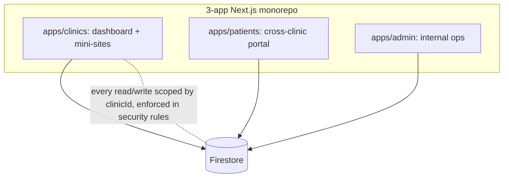
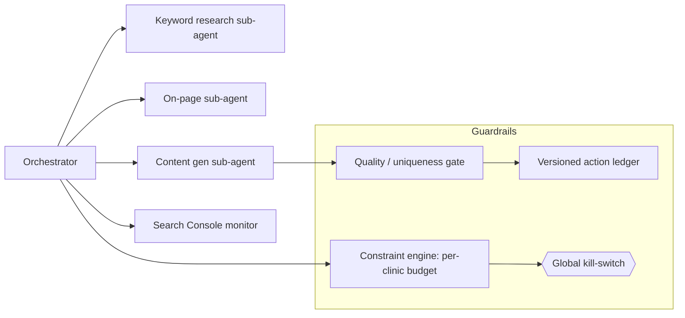

## The problem

Small clinics want to be online and bookable without hiring an agency. ClinicSynch gets a clinic live in a day: a public mini-site, a booking link, patient records in one place, automated WhatsApp follow-ups, and then it quietly grows their search presence with an autonomous agent. Built solo in ~4 weeks (a 4-6 month job the old way).

## Architecture: multi-tenant by construction

Tenant isolation is enforced at the **Firestore level**: every read/write is scoped by `clinicId` in security rules, never trusted to client logic. Shared packages (`@clinicsync/firebase`, `@clinicsync/ui`, `@clinicsync/messaging`) keep the three apps consistent.

## The autonomous SEO agent ("Pulse")

This is the differentiator: each clinic gets an agent that researches keywords, optimizes pages, generates content, and watches Search Console, **autonomously but inside hard guardrails** (this is YMYL healthcare content on a shared domain, so safety matters).

- **Orchestrator + ephemeral specialist sub-agents:** each task gets a fresh sub-agent.
- **Constraint engine** with hard per-clinic budgets, so the agent can't run away.
- **Quality / uniqueness gate** before anything publishes (to stay inside Google's scaled-content and YMYL policies on a shared domain).
- **Versioned action ledger:** every action is recorded and reversible.
- **Global kill-switch:** stop everything instantly.

## The clinic product

- **Public mini-sites:** drag-and-drop builder, theme presets, SEO-optimized SSR, JSON-LD, sitemap/robots/`llms.txt`, served at `clinicsynch.com/{slug}`.
- **Booking with double-book prevention:** server-side slot locking via an `appointmentSlots` subcollection, public + portal flows, doctor-specific conflict detection.
- **Consultation workspace:** chief complaint, vitals, exam notes, diagnoses, meds, lab orders + results, referrals, autosave every 30s, printable summary.
- **WhatsApp Cloud API:** appointment reminders, follow-ups, two-way messaging logged per clinic.
- **Subscription tiers + paywall** with entitlement-gated features; **PWA** with offline fallback.

## Stack

Next.js 14 · TypeScript · Firebase (Auth, Firestore, Cloud Functions, Storage, App Hosting) · Tailwind · WhatsApp Business API · Playwright E2E.

## Outcome

Live and onboarding clinics (**9 so far**), with the autonomous SEO agent growing each clinic's presence hands-free, all built and operated solo.
