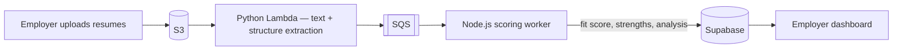
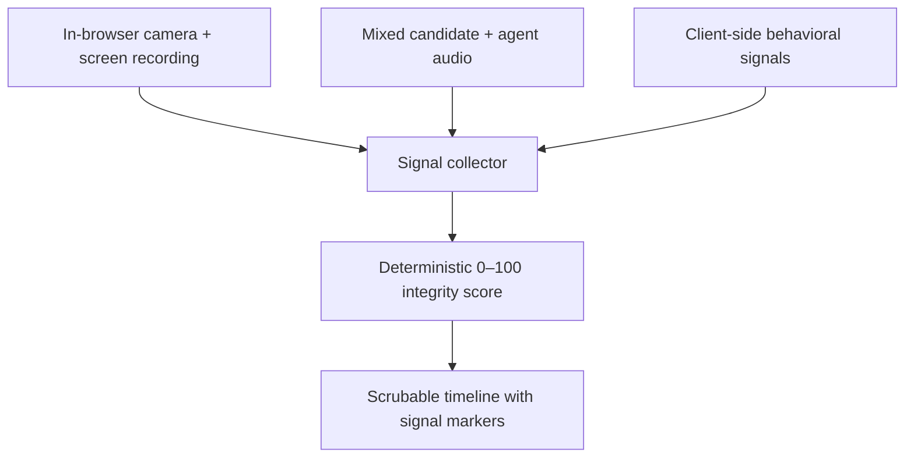

## The problem

Hiring teams drown in two things: unscreened resumes, and first-round interviews that don't scale. **Nayld Hire** (hire.nayld.ai) attacks both — auto-screen every applicant, invite the strong ones to a tier-2 AI interview, and get back a result you can actually trust.

It's the employer side of Nayld; the candidate-facing practice product is [Nayld Prep](/case-studies/nayld-prep). Built solo, end to end, in about six weeks.

## Async screening pipeline

Resume screening is fully event-driven — no polling, no cron hacks:



```text title="the flow"
S3 upload
  → Python Lambda (text + structure extraction)
  → SQS
  → Node.js worker (LLM scoring → fit score, strengths, analysis)
  → Supabase (hire schema)
```

Because it's queue-backed, it scales to **thousands of concurrent resumes** without falling over — a spike just drains through SQS instead of taking the app down.

## Tier-2 AI interviews

Promising candidates get invited to an AI voice interview that runs on the **same realtime voice stack as [Nayld Prep](/case-studies/nayld-prep)** — WebRTC, sub-second latency, VAD-tuned turn-taking — but tuned for evaluation rather than practice, producing structured scoring the employer can compare across candidates.

## Interview integrity

Employers need to trust the result, so every interview produces a deterministic **0–100 integrity score**:



- In-browser **camera + screen recording**, with mixed candidate + agent audio.
- **Client-side behavioral signals** captured throughout the session.
- A timeline the employer can scrub, with markers where signals fired — so a score is always explainable, never a black box.

## Billing & authorization

- **Layered billing** — subscription sessions → agent-scoped add-on credits → legacy free credits, all resolved at launch-code exchange (never at the eligibility check), so entitlement and consumption can't drift apart.
- **Database-owned authorization** — middleware does coarse page-group protection; every route handler then verifies company ownership against Supabase rows, so a valid session can never read another company's data.

## Stack

Next.js 14/16 · TypeScript · Supabase (Postgres, `hire` schema) · OpenAI Realtime API + GPT-4o · AWS Lambda / SQS / S3 / SES / Amplify · Terraform · Fastify. pnpm/Turbo monorepo sharing `@nayld/auth` + `@nayld/supabase` with [Nayld Prep](/case-studies/nayld-prep).

## Outcome

Live at **hire.nayld.ai** with **280+ resumes parsed**, screening that scales to thousands of concurrent uploads, and trustworthy, explainable interview results — built and operated solo.
