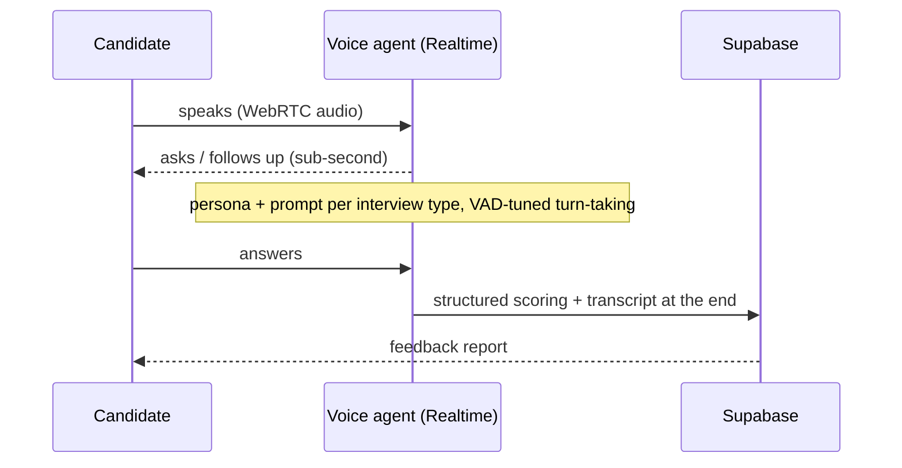

## The problem

Interview prep is mostly reading lists of questions you'll never rehearse out loud. The thing that actually rattles people, speaking under pressure in real time to someone who follows up, is the one thing you can't practice from an article. **Nayld Prep** (nayld.ai) fixes that: candidates run realistic mock interviews against a voice agent they genuinely converse with, then get a structured breakdown of how they did.

It's one half of Nayld, the candidate side. The employer side lives at [Nayld Hire](/case-studies/nayld-hire). The whole thing was built solo, end to end, in about six weeks, a team-and-a-year effort the old way.

## Realtime voice, in the browser

The candidate talks to the agent over **WebRTC** straight from the browser, with sub-second latency. The hard part isn't "call an API." It's making a multi-minute spoken conversation feel human and stay on track.

- **Tiered agents:** a lighter realtime model drives quick screening-style sessions; a stronger one drives deep, role-specific mock interviews. Each has its own persona, voice, prompt, and target duration.
- **Natural turn-taking:** voice-activity detection tuned so the agent doesn't talk over you or cut you off mid-thought, and knows when you've actually finished an answer versus just paused.
- **Stay-in-character prompting:** a prompt architecture that keeps the agent consistent across a 20-minute conversation without drifting, asks sensible follow-ups based on your answers, and emits **structured JSON scoring** when the session ends.
- **Resilience:** fallback and retry handling for when the realtime API hits limits mid-call, so a long interview doesn't just die.

## Structured feedback, not vibes

A session isn't useful if it ends with "good job." Every interview produces a structured report (strengths, areas to work on, and a per-dimension breakdown) derived from the same scoring the agent emits at the end of the call, persisted to Supabase and shown back to the candidate.

## Stack

Next.js 14/16 · React 18/19 · TypeScript · Supabase (Postgres) · OpenAI Realtime API + GPT-4o · AWS Amplify · pnpm/Turbo monorepo. The candidate app shares `@nayld/auth` and `@nayld/supabase` packages with the employer app, so auth and data access stay consistent across both products.

## Outcome

Live at **nayld.ai** with **257 users, 330+ interviews**, and **#2 product of the day on TinyHub** at launch, built and operated solo. The realtime voice stack proven here is the same one [Nayld Hire](/case-studies/nayld-hire) reuses for its tier-2 employer interviews.
