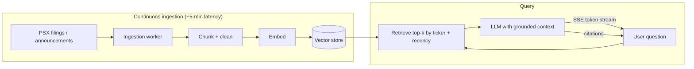

## The problem

Retail investors on the Pakistan Stock Exchange make decisions on scattered PDFs — corporate announcements, financial statements, filings — that nobody has time to read. PSX Intelligence turns that corpus into a **research copilot**: ask a question about a company and get an answer grounded in its actual filings, with sources cited, streamed as it generates. Built solo.

## Architecture

## What makes it work

- **Continuous ingestion at ~5-minute latency** — new filings and announcements are chunked, embedded, and indexed automatically, so the corpus stays current without manual reloads.
- **RAG grounding** — answers are retrieved from the actual documents (scoped by ticker and recency) and the model is constrained to that context, so it cites sources instead of hallucinating numbers.
- **Token streaming over SSE** — responses stream word-by-word for a live, low-latency feel rather than a spinner-then-wall-of-text.
- **Response caching** — repeated/similar queries are served from cache to cut cost and latency.

## Why it matters

Financial answers are only useful if you can trust them. The whole design is about **traceability**: every claim points back to a filing, the corpus is always fresh, and the user watches the answer build in real time. It's the same grounded-RAG pattern I now reuse across products — including the agent on this very site.

## Stack

Next.js · TypeScript · vector store + embeddings (RAG) · LLM with server-sent-events streaming · continuous ingestion pipeline.

## Outcome

Live at psxintelligence.com — a grounded, source-cited research copilot over a continuously-updated PSX corpus, built and operated solo.
